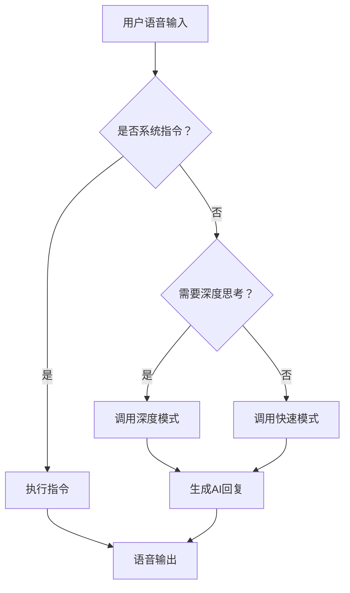

# 智能导盲犬总纲

介绍词略。

功能需求：

1. 进行步行范围内的导航。
2. 进行简单的人机对话。
3. 拍照、摄像等简单功能。

由于大多数的资源都由python编写，所以这里使用python语法。

```cmd
+	smart_guide_dog/
├── config/                  # 配置文件
│   ├── settings.yaml        # 主配置文件
│   └── voice_profiles/      # 语音包配置
├── core/                    # 核心功能模块
│   ├── __init__.py
│   ├── navigation.py        # 导航功能
│   ├── ai_conversation.py   # AI对话核心
│   ├── camera_control.py    # 拍照/摄像
│   └── command_parser.py    # 指令解析器
├── hardware/                # 硬件抽象层
│   ├── __init__.py
│   ├── audio_interface.py   # 音频输入输出
│   ├── motor_control.py     # 电机控制
│   ├── sensors.py           # 传感器集成
│   └── camera_driver.py     # 摄像头驱动
├── services/                # 第三方服务
│   ├── deepseek_api.py      # DeepSeek 接口
│   └── tts_services.py      # 语音合成服务
├── utils/                   # 工具函数
│   ├── config_loader.py     # 配置加载
│   ├── logger.py            # 日志系统
│   └── voice_feedback.py    # 语音反馈工具
├── startup/                 # 启动相关
│   ├── setup_wizard.py      # 首次启动向导
│   └── systemd_service      # 系统服务配置
├── main.py                  # 主程序入口
└── requirements.txt         # 依赖列表
```


## 导航功能

尚未完全了解，暂时挖坑


## 人机对话

简单构想：

1. 接入 DeepSeek 进行对话，优先对要素进行分析，如果属于高难的数学问题，可以选用深度思考，否则联网模式即可。
2. 区分指令与聊天。指令是一些特定设置的句子，这个暂时不知道如何进行解析，初步构想是先利用语言模型整理诉求，随后使用合适的指令进行处理。
3. 上述核心功能完成后，可以考虑加入用户一些用户自设部分，比如自启动时一些基础的出厂设置等。

## 拍照摄像

鉴于产品主要受众为盲人，需要详细语音指导以进行充分引导（当然最好产品也可以面对非残障人群，可以在出厂设置中进行一些简单的处理以取消引导，暂时不知道主板是否有陀螺仪功能，所以暂留）


## 其他美化

例如可以修改语音包之类的，这个有空再加。


# 对于细节部分的思考

以下是针对智能导盲犬项目各模块功能的详细说明及运行流程展示，结合项目需求和文件结构设计：

> 这一部分代码仅供思维上的参考，大概率是运行不了的。这一部分的设计完全基于我自己（周泽共）对项目的部分理解与DeepSeek的帮助，具体可以进行改动。
>
> 不过我相信，这样的文件结构的设计是有利于团队协作的，因为各个部分拆分后都很基础，我们可以轻松的分配编写哪些文件。
>
> 关于函数名称的规范，我的期望是可以开一个云文档表示，这也能尽可能地提升各种代码的互通互联性。

---

### 核心模块功能说明及运行流程

#### 1. **主程序入口 (main.py)**
**功能**：系统启动核心，协调各模块工作  
**运行流程**：
```python
# 加载系统配置
config = load_config("config/settings.yaml")

# 初始化硬件系统
audio = AudioSystem(config)
camera = CameraSystem(config)
navigator = NavigationSystem(config)

# 初始化AI对话系统
conversation = AIConversation(config)

while True:
    # 监听用户语音
    user_input = audio.listen()
    
    if "关机" in user_input:
        audio.speak("正在关机，再见！")
        shutdown_system()  # 执行安全关机流程
    
    # 处理用户输入
    response = conversation.process_query(user_input)
    
    # 语音反馈
    audio.speak(response)
```

---

#### 2. **AI对话核心 (core/ai_conversation.py)**
**功能**：智能对话处理中枢，区分指令/聊天  
**运行流程**：


**关键处理逻辑**：

可以优先用DeepSeek对于用户的需求进行翻译，形式上来讲可以删去考虑是否指令和是否深度思考的部分，一步到位。

---

#### 3. **指令解析系统 (core/command_parser.py)**
**功能**：识别并执行预定义指令  
**指令映射表**：
```python
COMMAND_MAP = {
    "拍照": CameraSystem.capture_photo,
    "录像": CameraSystem.start_recording,
    "停止录像": CameraSystem.stop_recording,
    "导航到": NavigationSystem.start_navigation,
    "音量": AudioSystem.set_volume,
    "切换模式": SystemManager.switch_mode
}
```

**执行流程示例**：
```
用户说："帮我导航到电梯"
→ 识别关键词"导航到"
→ 提取参数"电梯"
→ 调用 NavigationSystem.start_navigation("电梯")
→ 返回语音："正在规划前往电梯的路线"
```

---

#### 4. **拍照引导系统 (core/camera_control.py)**
**功能**：盲人友好的拍照引导  
**语音引导流程**：

1. 请先站在原地不动，我会来到你的正前方
2. 我就在你的正前方，请弯腰拿起机器人以拍照
3. 是否已经拿起？
4. 是否拍照？

---

#### 5. **导航系统 (core/navigation.py)**
**功能**：环境感知与路径规划  
**运行流程**：

Again，IDK

---

#### 6. **硬件抽象层 (hardware/)**
**模块分工**：
1. `audio_interface.py`：语音输入/输出
   - 麦克风监听
   - 扬声器控制
   - 音量调节

2. `motor_control.py`：运动控制，我是希望能将导航系统的指令逐步在这一份代码中实现
   
   ```python
   def move_forward(duration):
       left_motor.forward(speed=70)
       right_motor.forward(speed=70)
       time.sleep(duration)
       stop_motors()
   ```
   
3. `sensors.py`：传感器集成，应该有用、但我不懂
   
   ```python
   class UltrasonicSensor:
       def get_distance(self):
           # 发送超声波脉冲
           # 计算返回时间
           return distance_cm
   ```
   
4. `camera_driver.py`：视觉处理，应该有用、但我不懂
   
   ```python
   def capture_image():
       img = camera.capture()
       apply_accessibility_enhancement(img)  # 增强对比度/亮度
       save_with_timestamp(img)
   ```

---

#### 7. **服务接口 (services/)**

**DeepSeek API对接**：
```python
class DeepSeekClient:
    def query(self, prompt, mode="fast"):
        headers = {"Authorization": f"Bearer {API_KEY}"}
        payload = {
            "model": "deepseek-chat" if mode == "fast" else "deepseek-coder",
            "messages": [{"role": "user", "content": prompt}]
        }
        response = requests.post(API_ENDPOINT, json=payload, headers=headers)
        return response.json()['choices'][0]['message']['content']
```

**TTS服务**：
```python
class TextToSpeech:
    def speak(self, text):
        if config['tts_service'] == "azure":
            azure_synthesize(text)
        else:  # 离线备用
            espeak.synth(text)
```

---

### 系统协作场景示例

#### 场景：用户请求拍照
1. **语音输入**  
   `audio_interface.py` 监听用户说："帮我拍张照片"

2. **指令识别**  
   `command_parser.py` 识别"拍照"指令

3. **执行拍照**  
   `camera_control.py` 启动引导式拍照流程：
   - 语音提示："请面向设备正前方"
   - 检测人脸位置
   - 倒计时拍照

4. **结果反馈**  
   `audio_interface.py` 播报："拍照完成，已保存三张照片"

---

#### 场景：复杂问题解答
1. **语音输入**  
   用户问："请解释相对论的基本原理"

2. **模式判断**  
   `ai_conversation.py` 检测到"原理"触发深度思考模式

3. **AI查询**  
   `deepseek_api.py` 使用deepseek-coder模型生成详细解释

4. **语音输出**  
   分段播报AI生成的解释（每段不超过15秒）

---

#### 场景：导航到指定位置
1. **语音指令**  
   用户说："导航到三楼电梯"

2. **指令解析**  
   `command_parser.py` 提取目的地"三楼电梯"

3. **路径规划**  
   `navigation.py` 结合激光雷达构建地图

4. **实时导航**  
   - 超声波避障
   - 语音提示："前方右转"
   - 电机控制轮胎转向

5. **到达通知**  
   播报："已到达三楼电梯"

---

### 配置系统 (config/)
**settings.yaml 示例**：
```yaml
system:
  language: zh-CN
  voice_profile: gentle_female
  auto_brake: true  # 遇到障碍自动刹车

ai:
  provider: deepseek
  api_key: sk_xxxxxxxxxxxx
  deep_threshold: 3  # 深度思考触发词数量

camera:
  resolution: 1280x720
  guide_mode: detailed  # [simple/detailed/disabled]
```

这种模块化设计实现了：
1. **功能隔离**：各模块职责单一
2. **扩展便捷**：新增功能只需添加对应模块
3. **盲人友好**：全流程语音引导
4. **资源优化**：AI模式智能切换
5. **安全可靠**：硬件操作统一封装

后续开发可优先实现导航核心功能，再逐步完善拍照引导和个性化设置模块。